# Nexus ROAS — Fluxo de Dados Completo

> Documentação técnica detalhada de todo o fluxo de dados: da visita do usuário no site até as plataformas de anúncios e o dashboard de analytics.

---

## Índice

1. [Visão Geral](#1-visão-geral)
2. [Diagrama Mermaid — Fluxo Completo](#2-diagrama-mermaid--fluxo-completo)
3. [Fase 1 — Visita ao Site e Carregamento do Pixel](#3-fase-1--visita-ao-site-e-carregamento-do-pixel)
4. [Fase 2 — Coleta de Eventos (Beacon)](#4-fase-2--coleta-de-eventos-beacon)
5. [Fase 3 — Webhook de Compra (Gateway)](#5-fase-3--webhook-de-compra-gateway)
6. [Fase 4 — Ingest no Backend e ClickHouse](#6-fase-4--ingest-no-backend-e-clickhouse)
7. [Fase 5 — Dashboard de Analytics](#7-fase-5--dashboard-de-analytics)
8. [Armazenamentos de Dados](#8-armazenamentos-de-dados)
9. [Pontos de Transformação de Dados](#9-pontos-de-transformação-de-dados)
10. [Isolamento Multi-Tenant](#10-isolamento-multi-tenant)

---

## 1. Visão Geral

O sistema Nexus ROAS é composto por três camadas principais:

| Camada | Tecnologia | Responsabilidade |
|---|---|---|
| **Cloudflare Worker** | TypeScript + D1 + KV | Edge tracking, CAPI dispatch, identity resolution |
| **Backend NestJS** | Node.js + Postgres + Redis | Config management, ingest, analytics queries |
| **Analytics** | ClickHouse | OLAP para dados de eventos e receita |

**Fluxo de alto nível:**
```
Usuário → Site do Cliente → Worker (Edge) → CAPI Platforms
                                          ↓
                                    Backend Ingest
                                          ↓
                                     ClickHouse
                                          ↓
                                     Dashboard
```

---

## 2. Diagrama Mermaid — Fluxo Completo

```mermaid
flowchart TD
    %% ============================================================
    %% FONTES DE TRÁFEGO
    %% ============================================================
    subgraph TRAFFIC["🌐 Fontes de Tráfego"]
        direction LR
        META_ADS["Meta Ads\n(fbclid/fbc)"]
        TIKTOK_ADS["TikTok Ads\n(ttclid)"]
        GOOGLE_ADS["Google Ads\n(gclid/gbraid/wbraid)"]
        ORGANIC["Orgânico / Direto\n(UTMs)"]
    end

    %% ============================================================
    %% SITE DO CLIENTE
    %% ============================================================
    subgraph CLIENT_SITE["🏪 Site do Cliente"]
        direction TB
        BROWSER["Navegador do Usuário"]
        SCRIPT_TAG["&lt;script src='worker/pixel.js?pid=PIXEL_ID'&gt;"]
        SHOPIFY_CE["Shopify Customer Events\n(checkout sandbox)"]
        DATALAYER["Google dataLayer\n(eventos GA4)"]
    end

    %% ============================================================
    %% CLOUDFLARE WORKER (EDGE)
    %% ============================================================
    subgraph WORKER["⚡ Cloudflare Worker (Edge Global)"]
        direction TB

        subgraph PIXEL_SERVE["Rota: GET /tracking/pixel.js"]
            PS1["detectSiteId()\n(query param / host / custom domain)"]
            PS2["getConfig(siteId, env)\n1. Request cache\n2. Global cache (60s)\n3. KV site_config:{pixel_id}\n4. SITE_CONFIG var (fallback)"]
            PS3["Resolve nx_user cookie\n(HttpOnly, 730 dias)"]
            PS4["Injeta config no pixel.js\n__CONFIG__ + __NX_USER__"]
            PS5["Retorna pixel.js\nSet-Cookie: nx_user"]
        end

        subgraph PIXEL_JS["pixel.js (executado no browser)"]
            PJ_UTM["utm.js\nColeta UTMs do query string\n→ localStorage"]
            PJ_CLICK["click-ids.js\nExtrai fbp/fbc/ttp/ttclid\ngclid/gbraid/wbraid"]
            PJ_GEO["geo.js\nGeo-enriquecimento via IP APIs\n(city/state/country/currency)"]
            PJ_GA4["ga4.js\nInicializa gtag GA4\nga_client_id / session_id"]
            PJ_RULE["rule-engine.js\nMonitora: click / form_submit\nscroll / time_on_page / pageload"]
            PJ_DL["datalayer.js\nMonitora dataLayer do GA4\nConverte para eventos Nexus"]
            PJ_SHOPIFY["shopify.js\nCart Attributes sync\nnx_user → cart attributes"]
            PJ_LINK["link-decorator.js\nAppend UTMs + nx_user\nnos links de checkout"]
            PJ_TRACKER["tracker.js\nDispatcher principal\nPOST /collect/event"]
        end

        subgraph COLLECT_EVENT["Rota: POST /collect/event"]
            CE1["Extrai headers\nCF-Connecting-IP / User-Agent\nCloudflare geo (cf.city/region/country)"]
            CE2["Resolve nx_user\n1. body.nx_user\n2. Cookie HttpOnly\n3. UUID novo\n4. Tier-3: cart_token → D1"]
            CE3["Upsert D1 user_store\n(COALESCE: browser data tem prioridade)\n→ só se hasIdentityData()"]
            CE4["hashPII()\nSHA-256 normalizado\nemail/phone/name/city/state/country/zip\nexternal_id = nx_user"]
            CE_META["sendMetaCAPI()\nPOST graph.facebook.com/v25.0/{pid}/events\nevent_name, user_data, custom_data\nfbp/fbc, ip, ua, event_id"]
            CE_TIKTOK["sendTikTokEvent()\nPOST business-api.tiktok.com\n/open_api/v1.3/event/track/\nttp/ttclid, ip, ua"]
            CE_GA4["sendGA4Event()\nPOST google-analytics.com/mp/collect\nclient_id, session_id\nUTMs como params"]
            CE_GADS["sendGoogleAdsConversion()\nPOST googleads.googleapis.com/v19\ncustomer/{id}:uploadConversions\nOAuth2 (server) ou gtag (browser)"]
            CE_NEXUS["forwardToNexus()\nPOST backend/api/ingest/event\nX-Ingest-Key: {key}\nRetry 2x (1s/3s) em 5xx"]
            CE_LOG["D1 events table\nAudit log: status_code\npayload enviado / resposta / erro"]
        end

        subgraph COLLECT_WEBHOOK["Rota: POST /collect/webhook/{gateway}"]
            WH1["Detecção de rota\n?wid={webhook_id} → endpoint-based\n?pid={site_id} → legacy project-based"]
            WH2["KV webhook:{wid}\nWebhookEndpointConfig\n{account_id, gateway, site_ids[]}"]
            WH3["Filtro de aprovação\nPURCHASE_APPROVED / order_approved\n→ ignored se não aprovado"]
            WH4["GATEWAY_PARSERS[gateway]\nExtrai: nx_user, email, phone, name\norder_id, value, currency\nUTMs, cart_token, ip, ua"]
            WH5["Deduplicação D1\nINSERT OR IGNORE webhook_raw\n→ return duplicate se processed=1"]
            WH6["Identity Resolution D1\ngetUserStoreByAccount(nx_user)\nOU getUserStoreByCartToken(cart_token)\nTier-3 fallback attribution"]
            WH7["fdvMerge(storeData, webhookData)\nPrioridade: browser data\nCombina: fbp/fbc/ttp/UTMs/ip/ua"]
            WH8["hashPII() (mesmo fluxo)"]
            WH_LOOP["Para cada site_id\nem endpoint.site_ids[]"]
            WH_META["sendMetaCAPIWebhook()\nPurchase event\norder_id como event_id (dedup)"]
            WH_TIKTOK["sendTikTokWebhook()\nPurchase"]
            WH_GA4["sendGA4MP()\npurchase + transaction_id\nga_client_id sintético se ausente"]
            WH_GADS["sendGoogleAdsConversion()\nPurchase conversion"]
            WH_NEXUS["forwardToNexus()\nPurchase + order_id\ngateway, value, currency"]
            WH9["D1 webhook_raw\nprocessed = 1"]
        end

        subgraph WORKER_STORAGE["💾 Armazenamentos do Worker"]
            KV_SITE["KV: site_config:{pixel_id}\nSiteConfig JSON\n(platforms, triggers, nexus config)"]
            KV_DOMAIN["KV: domain_map:{domain}\n→ pixel_id\n(roteamento CNAME)"]
            KV_WH["KV: webhook:{wid}\nWebhookEndpointConfig\n(account_id, gateway, site_ids[])"]
            D1_USER["D1: user_store\nnx_user, fbp, fbc, ttp, ttclid\nga_client_id, UTMs, ip, ua\nemail, phone, cart_token\naccount_id (isolamento)"]
            D1_EVENTS["D1: events\nAudit log CAPI\nstatus_code, latência\npayloads enviados"]
            D1_WEBHOOKS["D1: webhook_raw\nPayload original do gateway\nprocessed flag\nDeduplicação por order_id"]
        end

        CRON["🕐 Cron Diário (03:00 UTC)\nDELETE events > 30 dias\nDELETE webhook_raw > 30 dias\nDELETE user_store > 90 dias"]
    end

    %% ============================================================
    %% PLATAFORMAS CAPI (DESTINOS EXTERNOS)
    %% ============================================================
    subgraph CAPI_PLATFORMS["📡 Plataformas CAPI (Destinos)"]
        direction LR
        META_CAPI["Meta CAPI\ngraph.facebook.com/v25.0\n/{pixel_id}/events\nPurchase / Lead / PageView..."]
        TIKTOK_CAPI["TikTok Events API\nbusiness-api.tiktok.com\n/open_api/v1.3/event/track\nPurchase / ViewContent..."]
        GA4_MP["GA4 Measurement Protocol\ngoogle-analytics.com/mp/collect\n?measurement_id&api_secret\npurchase / page_view..."]
        GADS_API["Google Ads Conversions API\ngoogleads.googleapis.com/v19\ncustomers/{id}:uploadConversions\nOAuth2 Bearer Token"]
    end

    %% ============================================================
    %% GATEWAYS DE PAGAMENTO
    %% ============================================================
    subgraph GATEWAYS["🛒 Gateways de Pagamento (Webhooks)"]
        direction LR
        GW_CARTPANDA["CartPanda\nPOST /collect/webhook/cartpanda"]
        GW_SHOPIFY["Shopify\nPOST /collect/webhook/shopify"]
        GW_HOTMART["Hotmart\nPOST /collect/webhook/hotmart"]
        GW_KIWIFY["Kiwify\nPOST /collect/webhook/kiwify"]
        GW_KIRVANO["Kirvano\nPOST /collect/webhook/kirvano"]
        GW_OUTROS["+ 8 outros gateways\n(Ticto, Hubla, Eduzz\nPerfectPay, Payt, Greenn\nLastlink, Pagtrust)"]
    end

    %% ============================================================
    %% BACKEND NESTJS
    %% ============================================================
    subgraph BACKEND["🖥️ Backend NestJS (VPS/Docker)"]
        direction TB

        subgraph INGEST["Módulo: Ingest"]
            ING1["POST /api/ingest/event\nAuth: X-Ingest-Key\nValidação contra project.ingestApiKey"]
            ING2["Upsert ClickHouse.leads\n(lead_id, utm_*, ip, ua, geo)"]
            ING3["Insert ClickHouse.events\n(event_type, value, currency, event_time)"]
            ING4["fire-and-forget\nnão bloqueia resposta"]
        end

        subgraph ANALYTICS["Módulo: Analytics"]
            AN1["GET /api/analytics/dashboard\n?start=&end=&projectId="]
            AN2["L1 Cache (in-process Map)\nTTL 30 min\nPor replica"]
            AN3["L2 Cache (Redis)\nTTL 60 min\nDistribuído (3 replicas)"]
            AN4["Lock distribuído Redis\nSET NX EX 10s\nEvita thundering herd"]
            AN5["Query ClickHouse\nevents_daily_revenue\nevents_daily_payment\nQuery limiter: max 4 concorrentes"]
        end

        subgraph PROJECTS["Módulo: Projects"]
            PR1["CRUD Projetos\n(Postgres via Prisma)"]
            PR2["_syncKV()\nEscreve site_config:{pixel_id}\nno KV ao criar/atualizar projeto"]
            PR3["_syncKV() custom_domain\nEscreve domain_map:{domain}\n→ pixel_id"]
        end

        subgraph WEBHOOKS_MOD["Módulo: AccountWebhooks"]
            AW1["CRUD Webhooks\n(Postgres via Prisma)"]
            AW2["_syncWebhookKV()\nEscreve webhook:{wid}\nno KV ao criar/atualizar"]
        end

        subgraph BACKEND_STORAGE["💾 Armazenamentos do Backend"]
            POSTGRES["PostgreSQL (Prisma)\nprojects, users, integrations\naccount_webhooks, pixel_events\nteam_memberships, project_access"]
            REDIS["Redis\nL2 analytics cache (60min)\nDistributed lock (10s)"]
            CLICKHOUSE["ClickHouse (OLAP)\nleads (ReplacingMergeTree)\nevents (MergeTree, partição mensal)\nevents_daily_revenue (Materialized View)\nevents_daily_payment (Materialized View)\nTTL: 1 ano"]
        end
    end

    %% ============================================================
    %% FRONTEND / DASHBOARD
    %% ============================================================
    subgraph FRONTEND["📊 Frontend (React)"]
        FE1["Dashboard\nReceita, Leads, Conversões\nPor UTM / Campanha / Gateway"]
        FE2["Configurações\nProjetos, Integrações\nWebhooks, Triggers"]
        FE3["Billing\nStripe, Planos"]
    end

    %% ============================================================
    %% CONEXÕES — FONTES DE TRÁFEGO → SITE
    %% ============================================================
    META_ADS -->|"fbclid → fbc cookie"| BROWSER
    TIKTOK_ADS -->|"ttclid param"| BROWSER
    GOOGLE_ADS -->|"gclid param"| BROWSER
    ORGANIC -->|"utm_* params"| BROWSER

    %% SITE → WORKER
    BROWSER --> SCRIPT_TAG
    SCRIPT_TAG -->|"HTTP GET"| PS1
    PS1 --> PS2
    PS2 -->|"KV lookup"| KV_SITE
    PS2 --> PS3
    PS3 --> PS4
    PS4 --> PS5
    PS5 -->|"pixel.js + Set-Cookie"| BROWSER

    %% pixel.js executado no browser
    BROWSER -->|"executa"| PJ_UTM
    BROWSER -->|"executa"| PJ_CLICK
    BROWSER -->|"executa"| PJ_GEO
    BROWSER -->|"executa"| PJ_GA4
    BROWSER -->|"executa"| PJ_RULE
    BROWSER -->|"executa"| PJ_DL
    BROWSER -->|"executa"| PJ_SHOPIFY
    BROWSER -->|"executa"| PJ_LINK
    DATALAYER -->|"eventos GA4"| PJ_DL
    SHOPIFY_CE -->|"checkout events"| PJ_SHOPIFY
    PJ_UTM --> PJ_TRACKER
    PJ_CLICK --> PJ_TRACKER
    PJ_GEO --> PJ_TRACKER
    PJ_GA4 --> PJ_TRACKER
    PJ_RULE -->|"dispara evento"| PJ_TRACKER
    PJ_DL -->|"converte evento"| PJ_TRACKER
    PJ_SHOPIFY -->|"Purchase/Lead"| PJ_TRACKER

    %% Beacon → Worker
    PJ_TRACKER -->|"POST /collect/event"| CE1
    CE1 --> CE2
    CE2 -->|"SELECT user_store"| D1_USER
    CE2 --> CE3
    CE3 -->|"UPSERT user_store"| D1_USER
    CE3 --> CE4
    CE4 --> CE_META
    CE4 --> CE_TIKTOK
    CE4 --> CE_GA4
    CE4 --> CE_GADS
    CE4 --> CE_NEXUS
    CE_META -->|"INSERT events"| D1_EVENTS
    CE_TIKTOK -->|"INSERT events"| D1_EVENTS
    CE_GA4 -->|"INSERT events"| D1_EVENTS
    CE_GADS -->|"INSERT events"| D1_EVENTS

    %% CAPI Dispatch → Plataformas
    CE_META -->|"HTTPS POST (waitUntil)"| META_CAPI
    CE_TIKTOK -->|"HTTPS POST (waitUntil)"| TIKTOK_CAPI
    CE_GA4 -->|"HTTPS POST (waitUntil)"| GA4_MP
    CE_GADS -->|"HTTPS POST (waitUntil)"| GADS_API

    %% Beacon → Nexus Ingest
    CE_NEXUS -->|"POST /api/ingest/event\nfire-and-forget\nretry 2x em 5xx"| ING1

    %% Gateways → Worker Webhook
    GW_CARTPANDA -->|"webhook PAID"| WH1
    GW_SHOPIFY -->|"webhook paid"| WH1
    GW_HOTMART -->|"PURCHASE_APPROVED"| WH1
    GW_KIWIFY -->|"order_approved"| WH1
    GW_KIRVANO -->|"SALE_APPROVED"| WH1
    GW_OUTROS -->|"gateway webhooks"| WH1

    WH1 --> WH2
    WH2 -->|"KV lookup"| KV_WH
    WH2 --> WH3
    WH3 --> WH4
    WH4 --> WH5
    WH5 -->|"INSERT OR IGNORE"| D1_WEBHOOKS
    WH5 --> WH6
    WH6 -->|"SELECT user_store\n(nx_user OU cart_token)"| D1_USER
    WH6 --> WH7
    WH7 --> WH8
    WH8 --> WH_LOOP

    WH_LOOP -->|"KV lookup config"| KV_SITE
    WH_LOOP --> WH_META
    WH_LOOP --> WH_TIKTOK
    WH_LOOP --> WH_GA4
    WH_LOOP --> WH_GADS
    WH_LOOP --> WH_NEXUS
    WH_META -->|"HTTPS POST"| META_CAPI
    WH_TIKTOK -->|"HTTPS POST"| TIKTOK_CAPI
    WH_GA4 -->|"HTTPS POST"| GA4_MP
    WH_GADS -->|"HTTPS POST"| GADS_API
    WH_NEXUS -->|"POST /api/ingest/event"| ING1
    WH_LOOP --> WH9
    WH9 -->|"UPDATE processed=1"| D1_WEBHOOKS
    WH_META -->|"INSERT events"| D1_EVENTS
    WH_TIKTOK -->|"INSERT events"| D1_EVENTS
    WH_GA4 -->|"INSERT events"| D1_EVENTS
    WH_GADS -->|"INSERT events"| D1_EVENTS

    %% Domain routing
    KV_DOMAIN -->|"resolve pixel_id"| PS2

    %% Ingest → ClickHouse
    ING1 --> ING2
    ING1 --> ING3
    ING2 -->|"fire-and-forget"| CLICKHOUSE
    ING3 -->|"fire-and-forget"| CLICKHOUSE
    ING4 --- ING2

    %% Backend Admin → KV sync
    PR2 -->|"wrangler KV PUT"| KV_SITE
    PR3 -->|"wrangler KV PUT"| KV_DOMAIN
    AW2 -->|"wrangler KV PUT"| KV_WH
    PR1 --- POSTGRES
    AW1 --- POSTGRES

    %% Analytics
    AN1 --> AN2
    AN2 -->|"miss"| AN3
    AN3 -->|"miss"| AN4
    AN4 -->|"lock acquired"| AN5
    AN5 -->|"SELECT"| CLICKHOUSE
    AN3 --- REDIS
    AN4 --- REDIS

    %% Frontend → Backend
    FE1 -->|"GET /api/analytics/dashboard"| AN1
    FE2 -->|"CRUD /api/projects"| PR1
    FE2 -->|"CRUD /api/webhooks"| AW1

    %% Cron
    CRON -->|"DELETE rows"| D1_USER
    CRON -->|"DELETE rows"| D1_EVENTS
    CRON -->|"DELETE rows"| D1_WEBHOOKS

    %% ============================================================
    %% ESTILOS
    %% ============================================================
    classDef workerBox fill:#f0f4ff,stroke:#4f46e5,color:#1e1b4b
    classDef capiBox fill:#fef3c7,stroke:#d97706,color:#78350f
    classDef storageBox fill:#f0fdf4,stroke:#16a34a,color:#14532d
    classDef backendBox fill:#fdf2f8,stroke:#9333ea,color:#581c87
    classDef gatewayBox fill:#fff7ed,stroke:#ea580c,color:#7c2d12
    classDef trafficBox fill:#eff6ff,stroke:#2563eb,color:#1e3a5f
    classDef frontendBox fill:#fafafa,stroke:#6b7280,color:#111827

    class WORKER,PIXEL_SERVE,PIXEL_JS,COLLECT_EVENT,COLLECT_WEBHOOK workerBox
    class CAPI_PLATFORMS,META_CAPI,TIKTOK_CAPI,GA4_MP,GADS_API capiBox
    class WORKER_STORAGE,KV_SITE,KV_DOMAIN,KV_WH,D1_USER,D1_EVENTS,D1_WEBHOOKS,BACKEND_STORAGE,POSTGRES,REDIS,CLICKHOUSE storageBox
    class BACKEND,INGEST,ANALYTICS,PROJECTS,WEBHOOKS_MOD backendBox
    class GATEWAYS,GW_CARTPANDA,GW_SHOPIFY,GW_HOTMART,GW_KIWIFY,GW_KIRVANO,GW_OUTROS gatewayBox
    class TRAFFIC,META_ADS,TIKTOK_ADS,GOOGLE_ADS,ORGANIC trafficBox
    class FRONTEND,FE1,FE2,FE3 frontendBox
```



---

## 3. Fase 1 — Visita ao Site e Carregamento do Pixel

**Arquivo:** `nexus-worker/src/routes/serve-pixel.ts`

### 3.1 Roteamento e Identificação do Site

```
GET /tracking/pixel.js?pid=PIXEL_ID
         ↓
detectSiteId():
  1. Query param: ?pid=PIXEL_ID
  2. Host header: pixel_id no subdomínio
  3. Custom domain: KV domain_map:{host} → pixel_id
```

### 3.2 Carregamento da Config (KV com Cache em Camadas)

```
getConfig(siteId, env):
  1. Request cache (in-memory por request)   → 0ms
  2. Global cache (in-memory, TTL 60s)       → 0ms
  3. KV site_config:{pixel_id}               → ~5ms
  4. Var SITE_CONFIG (fallback single-tenant) → 0ms
```

### 3.3 Resolução do Cookie `nx_user`

```
Prioridade:
  1. cookies['nx_user'] (HttpOnly)   → usuário recorrente
  2. generateUUID()                   → novo visitante

Set-Cookie: nx_user={uuid}; HttpOnly; Secure; SameSite=Lax;
            Domain={root_domain}; Max-Age=63072000 (730 dias)
```

### 3.4 Módulos do pixel.js no Browser

| Módulo | Função |
|---|---|
| `utm.js` | Captura UTMs do query string → localStorage |
| `click-ids.js` | Extrai fbp/fbc (Meta), ttp/ttclid (TikTok), gclid/gbraid/wbraid (Google) |
| `geo.js` | Enriquecimento geo via IP APIs (city/state/country/currency) |
| `ga4.js` | Inicializa gtag GA4, captura ga_client_id e session_id |
| `rule-engine.js` | Monitora DOM para triggers (click, form_submit, scroll, time_on_page, pageload) |
| `datalayer.js` | Intercepta eventos do dataLayer GA4 e converte para eventos Nexus |
| `shopify.js` | Sincroniza nx_user nos cart attributes do Shopify |
| `link-decorator.js` | Adiciona UTMs + nx_user nos links de checkout externos |
| `tracker.js` | Dispatcher central: envia POST /collect/event |

---

## 4. Fase 2 — Coleta de Eventos (Beacon)

**Arquivo:** `nexus-worker/src/collect/event.ts`

### 4.1 Payload de Entrada

```typescript
POST /collect/event
{
  event: "PageView" | "ViewContent" | "Lead" | "AddToCart" | "Purchase" | ...,
  event_id: "uuid-v4",             // Idempotência nas plataformas CAPI
  nx_user: "uuid",                  // Cookie HttpOnly (ou body fallback)
  page_url: "https://...",
  page_title: "...",
  user_data: {
    email?, phone?,
    first_name?, last_name?,
    city?, state?, country?, zip?
  },
  browser_data: {
    fbp: "_fbp cookie",             // Meta first-party cookie
    fbc: "_fbc cookie",             // Meta click ID
    ga_client_id: "GA1.1.xxx",
    ga_session_id: "...",
    ttp: "_ttp cookie",             // TikTok first-party cookie
    ttclid: "...",                  // TikTok click ID
    cart_token: "shopify-cart-token"
  },
  utm_data: {
    utm_source, utm_medium, utm_campaign,
    utm_content, utm_term, utm_id,
    utm_platform, utm_network,
    ad_id, adset_id, campaign_id,
    placement, creative_format, conversion_type
  },
  custom_data: {
    value?, currency?,
    content_ids?, contents?,
    content_name?, order_id?
  }
}
```

### 4.2 Resolução de Identidade (4 Tiers)

| Tier | Fonte | Condição |
|---|---|---|
| 1 | `body.nx_user` | Pixel.js injeta no POST |
| 2 | Cookie HttpOnly `nx_user` | Usuário recorrente |
| 3 | `cart_token` → D1 lookup | Checkout sem cookie (Safari ITP) |
| 4 | `generateUUID()` | Novo visitante sem referência |

### 4.3 Normalização e Hash de PII

```
hashPII():
  email    → lowercase().trim() → SHA-256
  phone    → "55" + digits se ≤11 chars → SHA-256
  name     → lowercase() → SHA-256
  city     → lowercase() → SHA-256
  state    → toLowerCase().slice(0, 2) → SHA-256
  country  → toLowerCase().slice(0, 2) → SHA-256
  zip      → replace(/[\s-]/g, '') → SHA-256
  external_id → nx_user → SHA-256
```

### 4.4 Mapeamento de Nomes de Eventos

| Nexus | Meta | TikTok | GA4 | Google Ads |
|---|---|---|---|---|
| PageView | PageView | Pageview | page_view | — |
| ViewContent | ViewContent | ViewContent | view_item | — |
| Lead | Lead | SubmitForm | generate_lead | Lead (se config) |
| AddToCart | AddToCart | AddToCart | add_to_cart | — |
| InitiateCheckout | InitiateCheckout | InitiateCheckout | begin_checkout | — |
| Purchase | Purchase | CompletePayment | purchase | Purchase (se config) |

### 4.5 Dispatch CAPI (fire-and-forget via `ctx.waitUntil`)

Todas as chamadas CAPI são não-bloqueantes. A resposta `/collect/event` é imediata:

```
Response: { status: 'ok', event_id: "uuid" }    → ~5ms
          (CAPI calls continuam em background)
```

---

## 5. Fase 3 — Webhook de Compra (Gateway)

**Arquivo:** `nexus-worker/src/collect/webhook.ts`

### 5.1 Roteamento de Webhooks

```
POST /collect/webhook/{gateway}

Com ?wid={webhook_id}  → Endpoint-based (novo)
  └→ KV webhook:{wid}
  └→ WebhookEndpointConfig.site_ids[]
  └→ Dispatch para N projetos

Com ?pid={site_id}     → Project-based (legacy)
  └→ Dispatch para 1 projeto
```

### 5.2 Gateways Suportados

| Gateway | Evento de Aprovação |
|---|---|
| CartPanda | status in PAID_EVENTS |
| Shopify | x-shopify-topic: orders/paid |
| Hotmart | event == 'PURCHASE_APPROVED' |
| Kiwify | webhook_event_type == 'order_approved' |
| Kirvano | event == 'SALE_APPROVED' |
| Ticto | approved events |
| Hubla | approved events |
| Eduzz | approved events |
| PerfectPay | approved events |
| Payt | approved events |
| Greenn | approved events |
| Lastlink | approved events |
| Pagtrust | approved events |

### 5.3 Resolução de Identidade (FDV Merge)

```
fdvMerge(storeData, webhookData):
  Para cada campo → COALESCE(storeData, webhookData)
  Prioridade: dados do browser (storeData) têm preferência
  Webhook preenche apenas campos ausentes no D1

Resultado mergedData contém:
  - fbp, fbc, ttp (do browser → melhor match CAPI)
  - UTMs primários (first-touch, do browser)
  - email, phone, name (do gateway → mais confiável para Purchase)
  - ip, ua (do browser OU gateway)
```

### 5.4 Deduplicação por `order_id`

```sql
-- D1 webhook_raw
INSERT OR IGNORE INTO webhook_raw 
  (site_id, gateway, order_id, payload)
  VALUES (?, ?, ?, ?)

SELECT processed FROM webhook_raw 
  WHERE site_id=? AND gateway=? AND order_id=?

-- Se processed=1: return { status: 'duplicate', skipped: true }
-- Se processed=0: prossegue com CAPI dispatch
-- Após dispatch: UPDATE webhook_raw SET processed=1
```

---

## 6. Fase 4 — Ingest no Backend e ClickHouse

**Arquivo:** `backend/src/ingest/ingest.service.ts`

### 6.1 Autenticação do Ingest

```
POST /api/ingest/event
Headers: X-Ingest-Key: {ingest_key}

Validação:
  SELECT * FROM projects 
    WHERE pixelId=? AND ingestApiKey=?
  
  → 401 se chave inválida
  → 200 { ok: true } imediato (fire-and-forget para ClickHouse)
```

### 6.2 Schemas ClickHouse

#### `leads` (ReplacingMergeTree)
```sql
ENGINE = ReplacingMergeTree(updated_at)
ORDER BY (pixel_id, id)

-- Upsert automático pelo ENGINE
-- Campos: id, pixel_id, email, phone, ip, ua
--         fbc, fbp, ttclid, ttp, gclid, gbraid, wbraid
--         country, state, city, zipcode
--         utm_source, utm_medium, utm_campaign, ...
--         ad_id, adset_id, campaign_id, placement
--         cart_token, external_id
```

#### `events` (MergeTree, partição mensal, TTL 1 ano)
```sql
ENGINE = MergeTree()
ORDER BY (pixel_id, event_time, event_type)
PARTITION BY toYYYYMM(event_time)
TTL event_time + INTERVAL 1 YEAR

-- Campos: id, lead_id, pixel_id, event_type
--         value, currency, fbc, fbp
--         ip, user_agent, source_url
```

#### Views Materializadas
```sql
-- events_daily_revenue: Receita diária agregada
ENGINE = SummingMergeTree((revenue, sales))
ORDER BY (pixel_id, event_date)

-- events_daily_payment: Receita por gateway
ENGINE = SummingMergeTree((revenue, sales))
ORDER BY (pixel_id, event_date, gateway)
```

---

## 7. Fase 5 — Dashboard de Analytics

**Arquivo:** `backend/src/analytics/analytics.service.ts`

### 7.1 Estratégia de Cache em 2 Camadas

```
Request GET /api/analytics/dashboard
         ↓
L1 Cache (Map in-process, TTL 30min)
  HIT fresco  → retorna ~0ms
  HIT stale   → retorna dados + refresh em background
  MISS        ↓

L2 Cache (Redis shared, TTL 60min)
  HIT fresco  → aquece L1 + retorna ~1ms
  HIT stale   → retorna dados + refresh em background
  MISS        ↓

Distributed Lock (Redis SET NX EX 10s)
  Lock acquired → executa query ClickHouse
  Lock failed   → retorna stale do L1/L2 (aguarda holder)
         ↓
ClickHouse Query
  (Query Limiter: max 4 queries concorrentes)
  SELECT FROM events_daily_revenue
    WHERE pixel_id IN (user_projects)
      AND event_date BETWEEN ? AND ?
```

---

## 8. Armazenamentos de Dados

### 8.1 Cloudflare KV — Config Store

| Chave | Valor | Sync |
|---|---|---|
| `site_config:{pixel_id}` | `SiteConfig` JSON completo | Backend `_syncKV()` ao criar/editar projeto |
| `domain_map:{domain}` | pixel_id (string) | Backend ao configurar custom domain |
| `webhook:{wid}` | `WebhookEndpointConfig` JSON | Backend `_syncWebhookKV()` ao criar webhook |

### 8.2 Cloudflare D1 — Identity + Audit

| Tabela | Retenção | Função |
|---|---|---|
| `user_store` | 90 dias | Identidade do visitante, UTMs, cookies CAPI |
| `events` | 30 dias | Audit log de dispatches CAPI (status, payloads) |
| `webhook_raw` | 30 dias | Payload original dos gateways, flag de deduplicação |

### 8.3 PostgreSQL (Prisma) — Dados Transacionais

| Tabela | Função |
|---|---|
| `users` | Contas, planos, webhookAccountId |
| `projects` | Configuração de projetos, pixelId, ingestApiKey |
| `integrations` | Configs de plataformas por projeto (Meta, TikTok, GA4, Google Ads) |
| `account_webhooks` | Endpoints de webhook, lista de projectIds |
| `pixel_events` | Regras de trigger (click, form_submit, scroll...) |
| `team_memberships` | Acesso de equipe por projeto |

### 8.4 ClickHouse — Analytics OLAP

| Tabela | Engine | Dados |
|---|---|---|
| `leads` | ReplacingMergeTree | Perfil do visitante (upsert por pixel_id+id) |
| `events` | MergeTree + TTL 1 ano | Eventos brutos (event_type, value, event_time) |
| `events_daily_revenue` | SummingMergeTree | Receita diária agregada por pixel_id |
| `events_daily_payment` | SummingMergeTree | Receita por gateway por dia |

---

## 9. Pontos de Transformação de Dados

| Transformação | Localização | Entrada → Saída |
|---|---|---|
| **Nome do evento** | `src/platforms/*.ts` | `"Purchase"` → `"CompletePayment"` (TikTok) / `"purchase"` (GA4) |
| **Hash PII** | `src/shared/hash.ts` | `"email@x.com"` → SHA-256 hex |
| **Normalização telefone** | `src/shared/hash.ts` | `"+55 11 98765-4321"` → `"5511987654321"` |
| **Normalização estado** | `src/shared/hash.ts` | `"São Paulo"` → `"sa"` (2-char ISO) |
| **Normalização moeda** | `src/gateways/cartpanda.ts` | `"R$"` → `"BRL"` |
| **Coleta UTM** | `pixel-src/utm.js` | Query string → localStorage → ingest |
| **Enriquecimento geo** | `pixel-src/geo.js` | IP → city/state/country/currency |
| **FDV merge** | `src/store/fdv.ts` | (browser_data, webhook_data) → merged record |
| **Cart token linkage** | `src/collect/event.ts` | cart_token → D1 lookup → nx_user |
| **Custom domain routing** | `src/shared/config.ts` | domain → KV → pixel_id |
| **Agregação diária** | ClickHouse Materialized View | events raw → events_daily_revenue |
| **Cache de dashboard** | `analytics.service.ts` | ClickHouse → Redis → Map in-process |

---

## 10. Isolamento Multi-Tenant

| Camada | Método | Campo-Chave |
|---|---|---|
| **KV Worker** | Prefixo `site_config:{pixel_id}` | `pixel_id` (UUID único por projeto) |
| **D1 user_store** | Coluna `account_id` | `user.webhookAccountId` |
| **D1 webhook routing** | `WebhookEndpointConfig.site_ids[]` | `wid` → `site_ids[]` |
| **ClickHouse** | `WHERE pixel_id IN (user_projects)` | `pixel_id` por projeto |
| **PostgreSQL** | `projects.pixelId UNIQUE` + `userId FK` | `userId` por usuário |
| **Team access** | `team_memberships` + `project_access` | `ownerId`, `membershipId`, `projectId` |

---

*Gerado em: 2026-04-17 — Nexus ROAS Data Flow Documentation*
